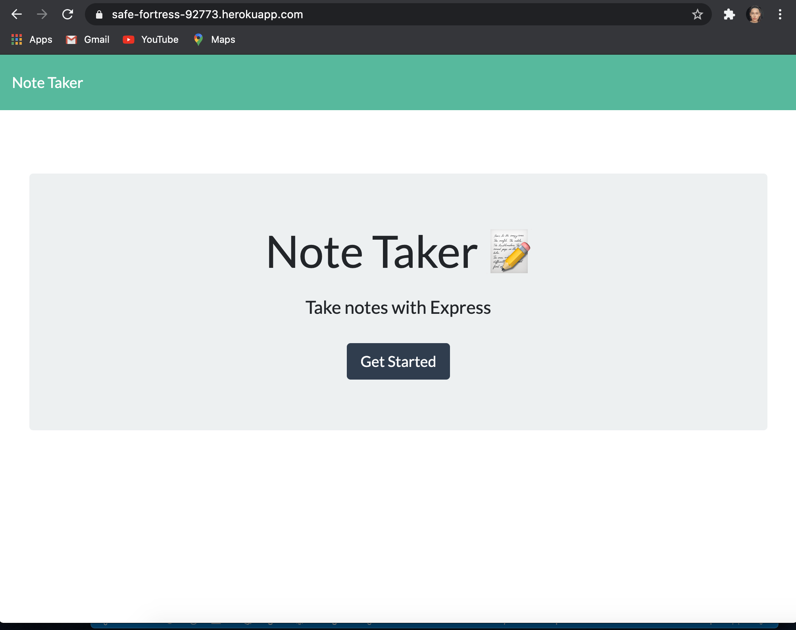
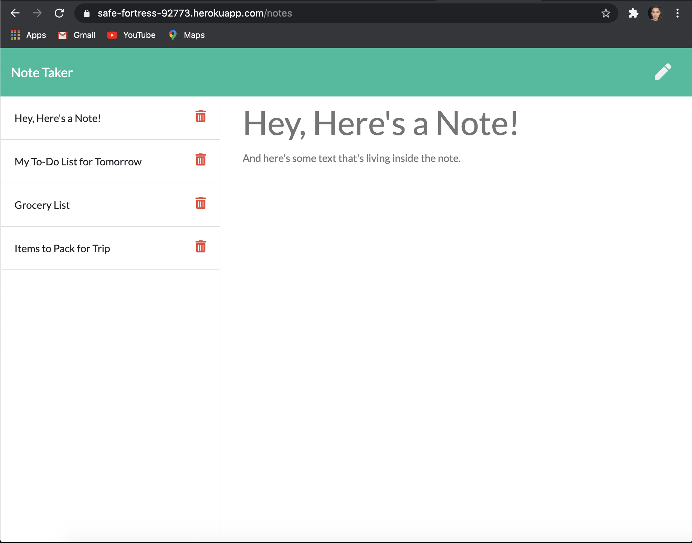

# Note Taker [w/ Heroku Deployment]

---

## Deployed Site Link:
https://safe-fortress-92773.herokuapp.com/

---
## Application Example

 ---
## Description

  *The what, why, and how:*

  In this assignment, we were tasked with creating an application that can be used to write, save, and delete notes. We were instructed to use an express backend and save/retrieve note data from a JSON file.

  We had to create HTML and API routes in order to make this a functional application. A db.json file was given and that is what I used to store, retrieve, and delete the note data. In order to do this, each note was given an id property when written into the db.json file.

  After the functional app was created, I then had to deploy it to Heroku. This was actually my biggest challenge, as I was having a lot of trouble deploying the site. After a few unsucessful attempts, I realized that I had 2 package.json files and it was confusing Heroku. I ended deleting the extra file and up moving my items out of the 'Develop' folder that I was originally given. Success, my site was deployed and fully functional!

  ---

## Table of Contents

  - [Deployed Site](#deployed-site-link)
  - [Applicaton Example](#application-example)
  - [Description](#description)
  - [Usage](#usage)
  - [Questions](#questions)
 
 ---

## Usage
  *Instructions and examples for use:*

Visit the Heroku link at the top of the page and you will be re-directed to the 'Home Page'. Click the "Get Started" button to be taken to the notes page. To write a new note, simply type in a title and a note! Then, press the 'save' icon button in the top right. The note will be saved to the column to the left, and you can check out the contents of this note by clicking on it.

To delete a note, simply press the red trash can icon. The note will disappear!! When you refresh the page, the deleted note will be gone and the saved notes will still be there.
  
---

## Questions?

  *For any questions about this application, please contact me via the information below:*

  GitHub: https://github.com/users/rachelkline
  
  Email: rachel_kline@icloud.com

---
   

  [Icons provided by https://fontawesome.com/]